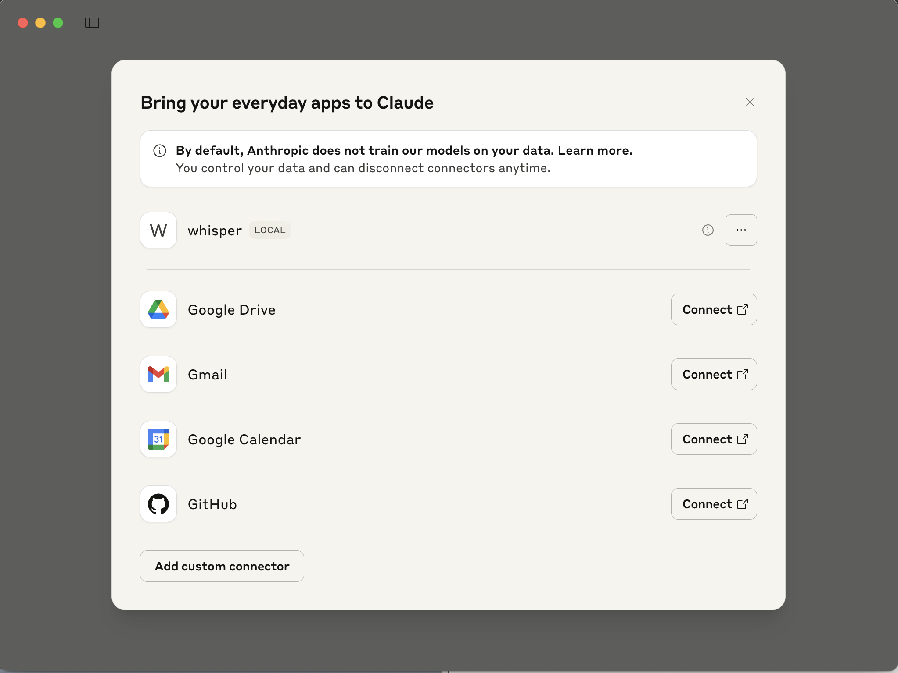
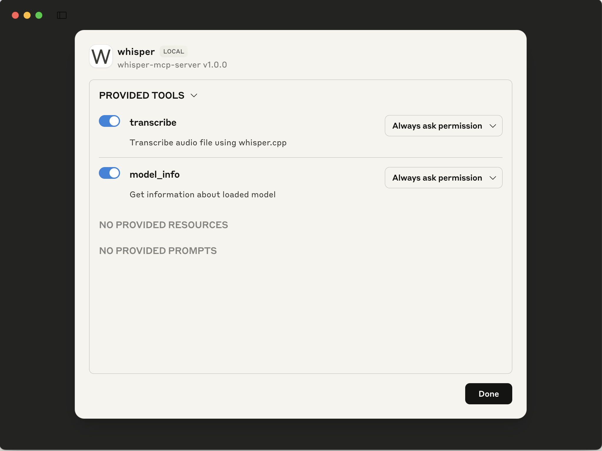
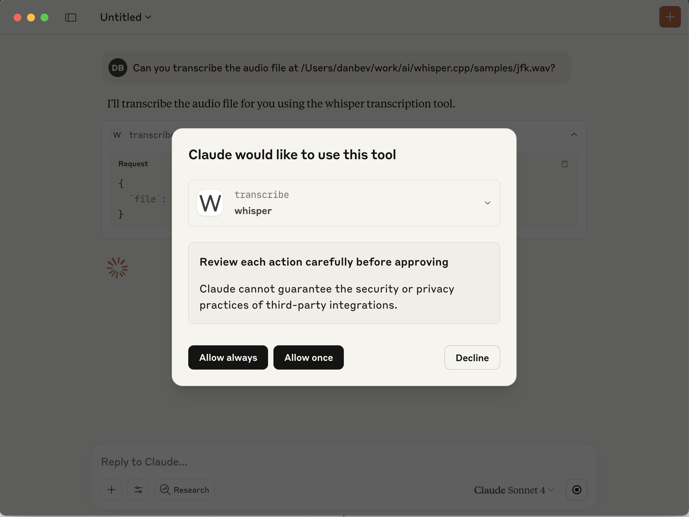
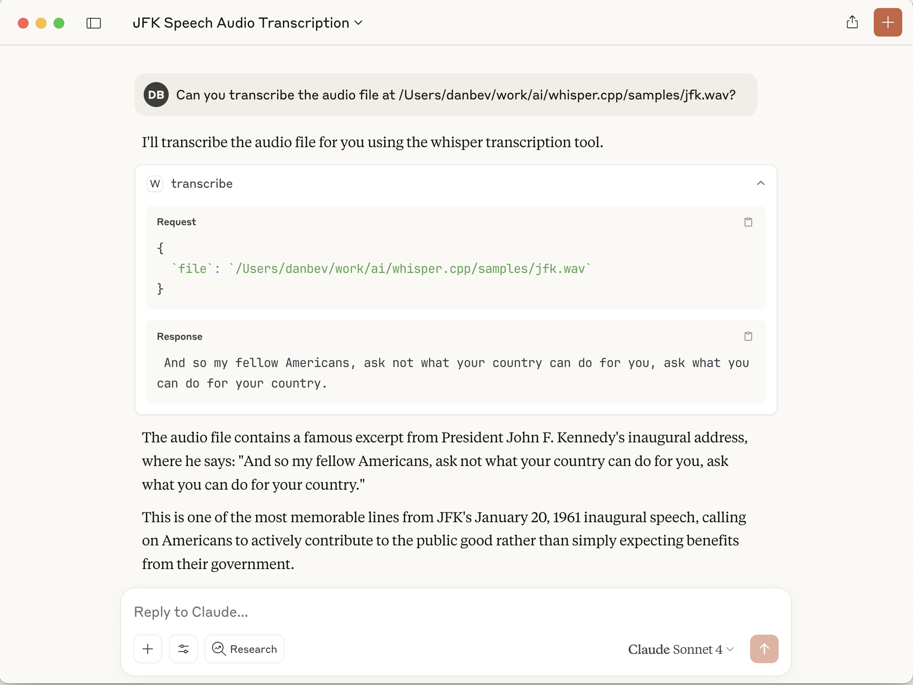

# whisper.cpp/examples/mcp
This directory contains an example of using the Model Context Protocol (MCP) with `whisper.cpp`. The transport
used in this example is the simple input/output (stdin/stdout) transport. When using the input/output transport,
the client is responsible for starting the server as a child process and the communication is done by reading
and writing data to stardard in/out.

## Usage
The stdio client demo can be run using the following command:
```
./build/bin/mcp-demo
```
This will initalize the server using the [initialization] lifecycle phase.
Following that the client will send a request for the list of tools ([tools/list]) that the server supports.
It will then send a request to transcribe an audio file.


### Claude.ai Desktop integration
The Whisper.cpp MCP server can be integrated with the Claude.ai Desktop application.

This requires adding a MCP server configuration to the Claude.ai Desktop:
```console
$ cat ~/Library/Application\ Support/Claude/claude_desktop_config.json
{
  "mcpServers": {
    "whisper": {
      "command": "/Users/danbev/work/ai/whisper.cpp/build/bin/whisper-mcp-server",
      "args": [
        "--model",
        "/Users/danbev/work/ai/whisper.cpp/models/ggml-base.en.bin"
      ]
    }
  }
}
```
Update the above paths to match your local system. And then restart the Claude.ai Desktop application.

After that, clicking on "Connect apps" should show the following:



And clicking on `[...]` should show the tools available:



We should then be able to transribe an audio file by using a prompt like this:
```console
Can you transcribe the audio file at /Users/danbev/work/ai/whisper.cpp/samples/jfk.wav?
```
And this will then prompt for accepting to run the transcription tool:



And this should result in a successful transcription:




[initialization]: https://modelcontextprotocol.io/specification/2025-03-26/basic/lifecycle#initialization
[tools/list]: https://modelcontextprotocol.io/specification/2025-03-26/server/tools#listing-tools
